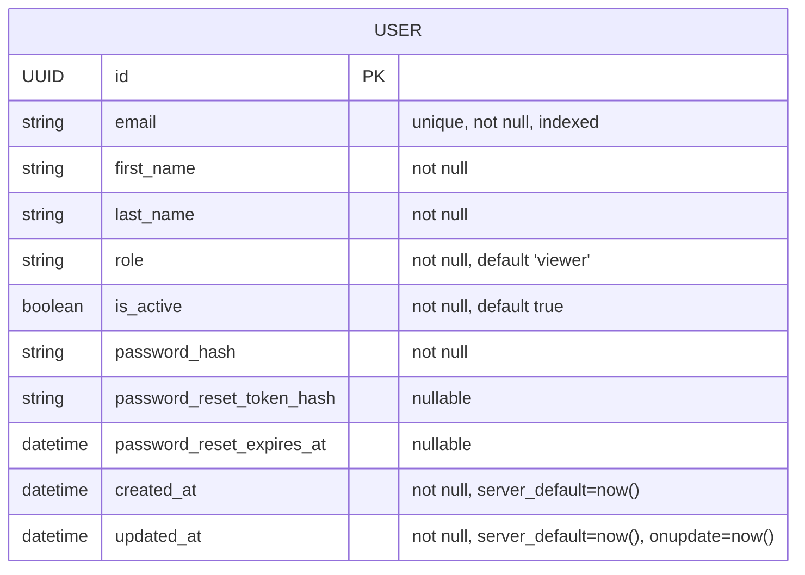

## Columns

| Column | Type | Nullable | Default | Notes |
|--------|------|----------|---------|-------|
| `id` | `UUID` | no | `uuid4()` | Primary key |
| `email` | `String(255)` | no | — | Unique, indexed |
| `first_name` | `String(50)` | no | — | |
| `last_name` | `String(50)` | no | — | |
| `role` | `String(20)` | no | `"viewer"` | `admin` or `viewer` |
| `is_active` | `Boolean` | no | `true` | Soft disable; inactive users cannot login |
| `password_hash` | `String(255)` | no | — | bcrypt hash |
| `password_reset_token_hash` | `String(255)` | yes | — | Hashed reset token |
| `password_reset_expires_at` | `DateTime(tz)` | yes | — | Token expiry |
| `created_at` | `DateTime(tz)` | no | `now()` | Auto-set on insert |
| `updated_at` | `DateTime(tz)` | no | `now()` | Auto-updated on change |

## Notes

- `display_name` is a **computed property** on `UserEntity` (`f"{first_name} {last_name}"`) — it is **not persisted** in the database.
- The domain entity uses value objects for `email` (`Email`) and `password_hash` (`Password`).
- `EntityId.generate()` uses `uuid4`; the model default also uses `uuid4`.
