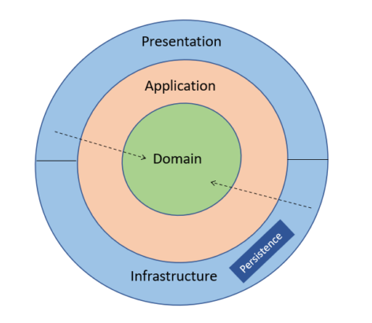

```plainttext
project-root/
├── domain/
│   ├── entities/
│   │   └── user.py                  # Core User entity (business logic)
│   ├── value_objects/
│   │   └── email.py                 # Value object for email validation
│   └── exceptions/
│       └── user_exceptions.py       # Custom exceptions for User domain
├── application/
│   ├── use_cases/
│   │   ├── create_user.py           # Use case for creating a User
│   │   ├── get_user.py              # Use case for fetching a User
│   │   └── update_user.py           # Use case for updating a User
│   ├── dto/
│   │   └── user_dto.py              # Data Transfer Object for User
│   ├── interfaces/
│   │   └── user_repository.py       # Repository interface for User
│   └── services/
│       └── user_service.py          # Application Service for high-level logic
├── infrastructure/
│   ├── repositories/
│   │   └── postgres_user_repository.py  # Implementation of UserRepository for PostgreSQL
│   └── config/
│       └── db_connection.py         # Database connection logic
├── presentation/
│   ├── web/
│   │   ├── user_routes.py           # API routes for User (e.g., FastAPI or Flask endpoints)
├── tests/
│   ├── unit/
│   │   ├── test_user_entity.py      # Unit tests for User entity
│   │   ├── test_user_service.py     # Unit tests for User service
│   │   └── test_user_repository.py  # Unit tests for repository interface
│   ├── integration/
│   │   └── test_user_endpoints.py   # Integration tests for User API endpoints
│   └── e2e/
│       └── test_user_flows.py       # End-to-end tests for User workflows
├── .github/
│   └── workflows/
│       └── ci.yml                   # GitHub Actions CI workflow
├── Dockerfile                       # Dockerfile for building the app
├── docker-compose.yml               # Docker Compose file for local development
├── requirements.txt                 # Python dependencies (or pom.xml for Java)
└── README.md                        # Project documentation
```